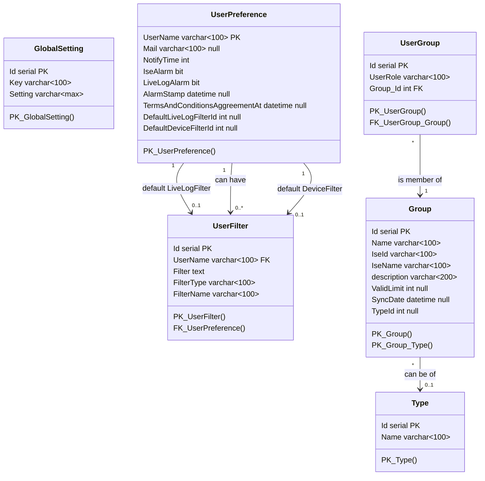

```mermaid
classDiagram

class GlobalSetting{
    Id serial PK
    Key varchar~100~
    Setting varchar~max~
    
    PK_GlobalSetting()
}

class UserFilter {
    Id serial PK
    UserName varchar~100~ FK
    Filter text
    FilterType varchar~100~
    FilterName varchar~100~
    
    PK_UserFilter()
    FK_UserPreference()
}
class UserPreference {
    UserName varchar~100~ PK
    Mail varchar~100~ null
    NotifyTime int
    IseAlarm bit
    LiveLogAlarm bit
    AlarmStamp datetime null
    TermsAndConditionsAggreementAt datetime null
    DefaultLiveLogFilterId int null
    DefaultDeviceFilterId int null
    
    PK_UserPreference()
}

class UserGroup {
    Id serial PK
    UserRole varchar~100~
    Group_Id int FK 
    
    PK_UserGroup()
    FK_UserGroup_Group()
}

class Group {
    Id serial PK
    Name varchar~100~
    IseId varchar~100~
    IseName varchar~100~
    description varchar~200~
    ValidLimit int null
    SyncDate datetime null
    TypeId int null
    
    PK_Group()
    PK_Group_Type()
}

class Type {
    Id serial PK
    Name varchar~100~

    PK_Type()
}


UserPreference "1" --> "0..1" UserFilter: default LiveLogFilter 
UserPreference "1" --> "0..*" UserFilter: can have 
UserPreference "1" --> "0..1" UserFilter: default DeviceFilter

UserGroup "*" --> "1" Group: is member of
Group "*" --> "0..1" Type : can be of
```
