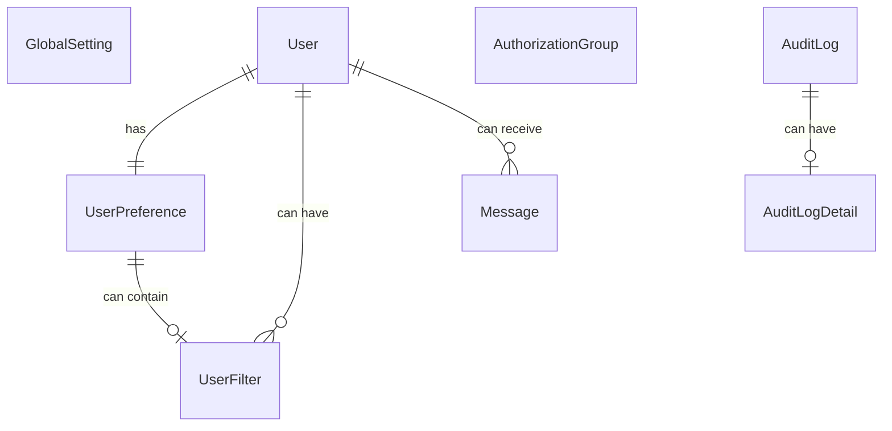
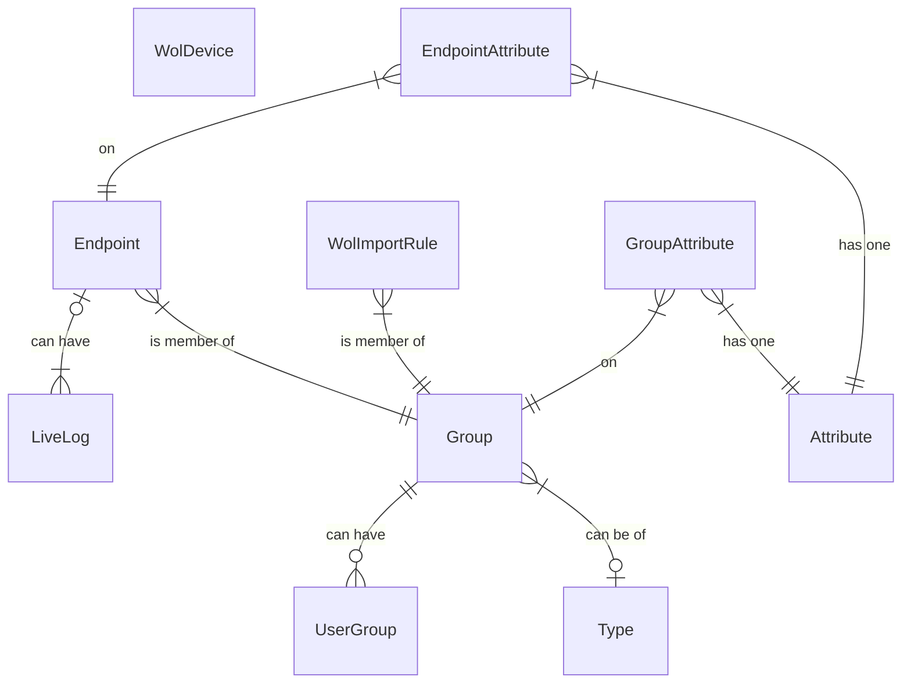
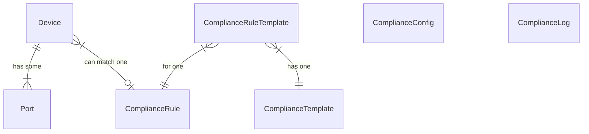
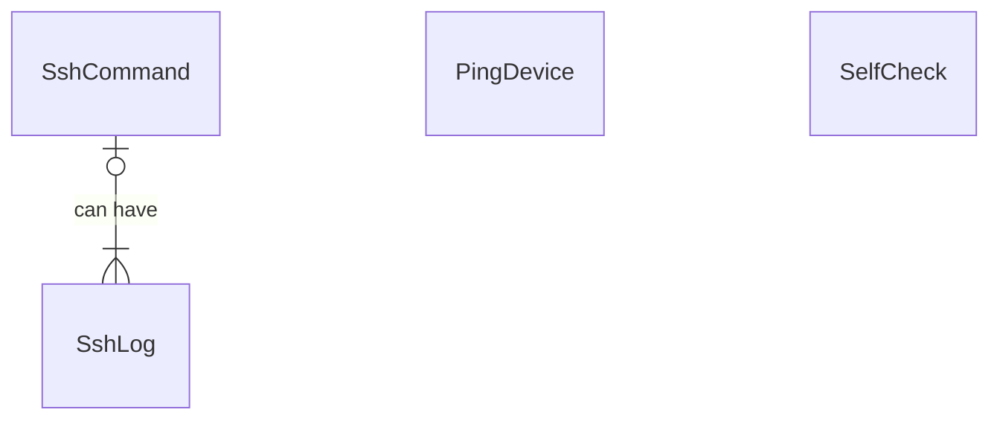
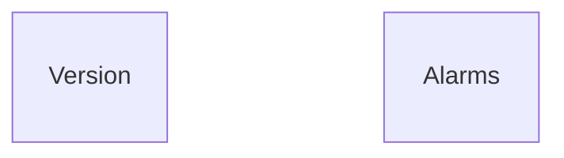
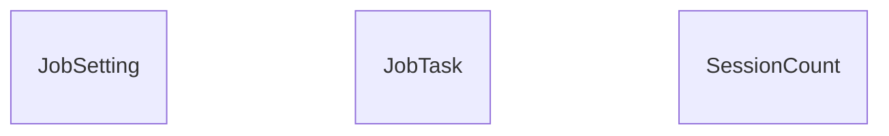

```mermaid
erDiagram
    GlobalSetting
    User ||--|| UserPreference: has
    User ||--o{ UserFilter: "can have"
    User ||--o{ Message: "can receive"
    UserPreference ||--o| UserFilter: "can contain"
    AuthorizationGroup
    AuditLog ||--o| AuditLogDetail: "can have"
```

```mermaid
erDiagram
    WolDevice
    Endpoint |o--|{ LiveLog: "can have"
    Endpoint }|--|| Group: "is member of"
    WolImportRule }|--|| Group: "is member of"
    Group ||--o{ UserGroup: "can have"
    Group }|--o| Type: "can be of"
    GroupAttribute }|--|| Attribute: "has one"
    GroupAttribute }|--|| Group: "on"
    EndpointAttribute }|--|| Endpoint: "on" 
    EndpointAttribute }|--|| Attribute: "has one"
```

```mermaid
erDiagram
    Device }|--o| ComplianceRule: "can match one"
    Device ||--|{ Port: "has some"
    ComplianceRuleTemplate }|--|| ComplianceTemplate: "has one"
    ComplianceRuleTemplate }|--|| ComplianceRule: "for one"
    ComplianceConfig
    ComplianceLog
```

```mermaid
erDiagram
    SshCommand |o--|{ SshLog: "can have"
    PingDevice
    SelfCheck
```

```mermaid
erDiagram
    Version
    Alarms
```

```mermaid
erDiagram
    JobSetting
    JobTask
    SessionCount
```
